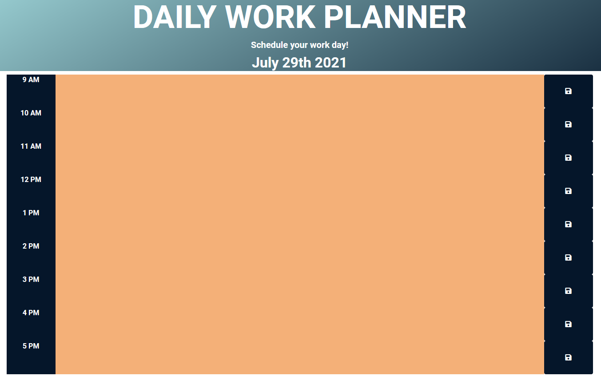
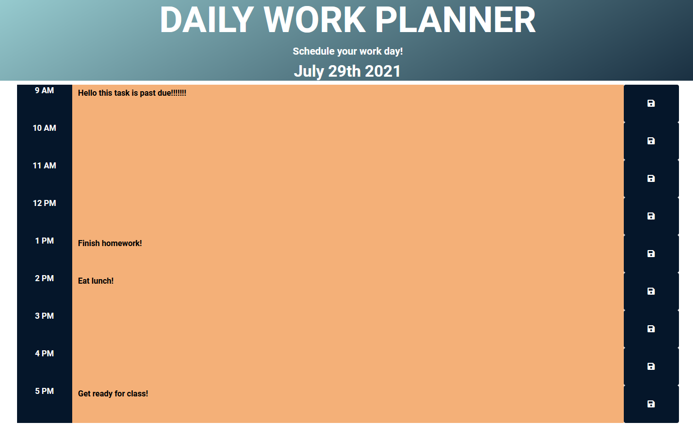

## ABOUT THIS ASSIGNMENT

- The objective of this assignment is to make a daily work planner for the client that will allow them to add events to each hour during an ormal business day.
- The work planner should have the current day displayed at the top of the calendar.
- When the client scrolls down the client is presented with timeblocks for standard business hours in which they can add any events or information they need in those time blocks. 
- When the client saves the event in the calendar it should also save the text for the even in local storage.
- Even in the page is refreshed all information should persist for the client. 
- Had help looking through the code and understanding exactly how everything works from this persons code for javascript as I have been having issues understanding where to start on my own. I went through and commented how I saw each section running and what the function is.  https://github.com/WillV1/day-planner I have also credited in the code itself. I am unsure as to the proper procedures of basing code/copying code of others similar assignments as to understand functionality. Please inform me if I would need to resubmit this assignment a different wawy as I would be happy to do so as I feel I have somewhat of an understanding of how javascript works I just need to practice more and rewatch/reread previous class days.

## SCREENSHOTS OF APPLICATION

## LINK TO DEPLOYED APPLICATION
- Deployed Application Link : https://mattyjaws.github.io/Daily-Work-Planner/